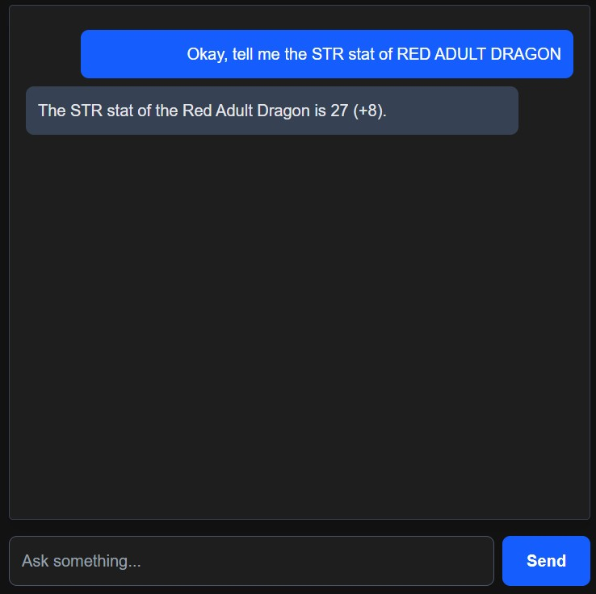

#  RAG Conversational Chatbot — FastAPI + Ollama + ChromaDB + Next.js

This project is a fully local **Retrieval-Augmented Generation (RAG)** chatbot system built using:

- **Ollama** → LLM inference (Gemma 3:4B)
- **ChromaDB** → Vector database for document retrieval
- **FastAPI** → Backend API for RAG pipeline
- **Next.js** → Frontend Chat UI
- **Python (venv)** → Embedding generation & preprocessing

The system allows you to upload PDF documents, embed them, store them in ChromaDB, and query them via a custom chat UI.

---
## Q_A



## RESOURCE (DnD_BasicRules_2018)


# ⚙️ System Architecture

User → Next.js UI (Port 3000)
↓
FastAPI Backend (Port 8000)
↓
RAG Pipeline (ChromaDB + Embeddings)
↓
Ollama (LLM Server, Port 11434)


---

# 🚀 Setup Instructions

Follow the steps below to set up and run the entire pipeline.

---

## ✔ Step 0 — Install Ollama (Required)

Download Ollama:

👉 https://ollama.com/download

Pull required models (Or choose other models) :

```bash
ollama pull gemma3:4b
```
```bash
ollama pull mxbai-embed-large:latest
```


## ✔ Step 1 — Create and Activate Python Virtual Environment
```bash
python -m venv venv
```

```bash
./venv/Scripts/activate
```

Install dependencies:
```bash
pip install -r requirements.txt
```

## ✔ Step 2 — Start the Ollama Model Server In a New Terminal
```bash
ollama serve
```

## ✔ Step 3 — Generate Embeddings (Vectorization)
```bash
python vectorize.py
```

## ✔ Step 4 — Start the FastAPI Backend (RAG API)

```bash
cd rag_backend
```

Run FastAPI:
```bash
uvicorn main:app --reload --port 8000
```

## ✔ Step 5 — Start the Next.js Chat UI (Frontend)
Inside rag_ui/:

```bash
npm install
```
```bash
npm run dev
```


[](http://localhost:3000)
